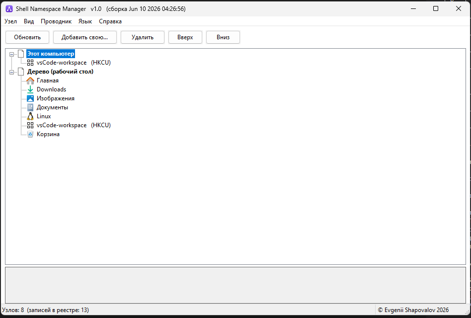

# Shell Namespace Manager: добавить папку в «Этот компьютер» и настроить Проводник Windows

**ShellNsManager** - портативная (portable) GUI-утилита для Windows 10/11, которая помогает навести порядок в Проводнике: добавить свою папку в **«Этот компьютер»**, настроить дерево навигации, скрыть лишние системные элементы, убрать или вернуть **«Главная»** и **«Быстрый доступ»**.

Программа делает то, что обычно приходится делать вручную через `regedit`: работает с Windows Shell Namespace, CLSID-узлами, `SortOrderIndex` и параметрами навигационной панели. При этом у пользователя есть понятный графический интерфейс, кнопка перезапуска Проводника и автоматические `.reg`-бэкапы перед опасными операциями.

[English README](README.en.md) | [Как скачать](DOWNLOAD.md) | [Установка и сборка](INSTALL.md) | [GitHub Releases](../../releases/latest)

## Скачать за 10 секунд

1. Откройте страницу [GitHub Releases](../../releases/latest).
2. Найдите блок **Assets** в последнем релизе.
3. Скачайте готовый архив или файл программы, например `ShellNsManager-v1.0-win64.zip` или `ShellNsManager.exe`.
4. Распакуйте архив, если скачали `.zip`.
5. Запустите `ShellNsManager.exe` и подтвердите запрос UAC.

**Если вы обычный пользователь: не нажимайте `Code -> Download ZIP`.** Этот пункт скачивает исходный код для разработчиков, а не готовую программу. Не скачивайте `Source code (zip)` и `Source code (tar.gz)` в релизе, если хотите просто запустить приложение.

Если раздел **Releases** пуст или в релизе нет блока **Assets**, значит готовый публичный релиз еще не опубликован. Разработчик может собрать программу из исходников по инструкции в [INSTALL.md](INSTALL.md).

## Что умеет ShellNsManager

- Показывает реальные namespace-узлы Проводника в разделах **«Этот компьютер»** и **«Дерево (рабочий стол)»**.
- Объединяет 64-битные и 32-битные записи одного GUID, чтобы список был читаемым.
- Добавляет пользовательскую папку в «Этот компьютер» и/или дерево навигации.
- Позволяет выбрать имя, папку-цель и иконку для добавляемого узла.
- Пишет узел в `HKCU` для текущего пользователя или в `HKLM` системно для всех пользователей.
- Удаляет выбранные namespace-узлы с предварительным `.reg`-бэкапом.
- Меняет порядок узлов через `SortOrderIndex`.
- Скрывает встроенные элементы дерева, например системные CLSID-объекты рабочего стола.
- Включает и выключает **полный вид папок** в навигационной панели.
- Скрывает и восстанавливает **«Главная»** в Windows Explorer.
- Скрывает и показывает **«Быстрый доступ»**.
- Очищает закрепленные и частые папки Quick Access с сохранением бэкапа.
- Перезапускает `explorer.exe`, чтобы изменения сразу появились в интерфейсе Windows.
- Имеет русский интерфейс по умолчанию и английскую локализацию.

## Кому это нужно

ShellNsManager полезен, если вы:

- хотите добавить рабочую папку, облачную папку, сетевой каталог или проект в «Этот компьютер»;
- настраиваете Windows 11 после установки и хотите убрать «Главная» или «Быстрый доступ»;
- администрируете рабочие места и хотите быстро привести Проводник к единому виду;
- не хотите вручную искать GUID, CLSID и ветки `NameSpace` в реестре;
- регулярно чините Windows Explorer после твиков, обновлений или корпоративных образов.

## Почему лучше, чем вручную через regedit

Ручной способ требует знать точные ветки реестра, различать `HKCU`, `HKLM`, `Wow6432Node`, `CLSID`, `MyComputer\NameSpace` и `Desktop\NameSpace`. Ошибка в GUID или удаление не той ветки может сломать отображение системных элементов.

ShellNsManager показывает элементы списком, делает бэкап перед изменением, проверяет существование папки-цели при добавлении узла и помогает применить изменения через перезапуск Проводника.

## Скриншоты



Главное окно: список namespace-узлов в разделах «Этот компьютер» и «Дерево (рабочий стол)», панель действий и строка состояния.

## Как пользоваться

### Добавить свою папку в «Этот компьютер»

1. Запустите `ShellNsManager.exe` от имени администратора.
2. Нажмите **Добавить свою...**.
3. Укажите имя, папку-цель и иконку.
4. Выберите, где показывать узел: **Этот компьютер**, **Дерево (рабочий стол)** или оба места.
5. Выберите `HKCU`, если узел нужен только текущему пользователю, или `HKLM`, если он должен быть системным.
6. Нажмите **Создать**.
7. Нажмите **Перезапустить Проводник**, если изменение не появилось сразу.

### Удалить или скрыть элемент

Выберите узел в дереве и нажмите **Удалить**. Перед удалением программа сохранит `.reg`-бэкап в папку `backups\YYYYMMDD-HHMMSS\` рядом с `.exe`.

Для встроенных элементов используйте меню **Узел -> Скрыть встроенный элемент...**. Доступ к объекту по прямому пути сохраняется, но он перестает отображаться в дереве.

### Вернуть изменения

Откройте папку `backups`, найдите нужный `.reg`-файл и импортируйте его двойным кликом или через `regedit`. После восстановления перезапустите Проводник или перезагрузите Windows.

## Для тех, кто не умеет пользоваться GitHub

GitHub часто показывает большую зеленую кнопку **Code**. Для обычного пользователя она почти всегда не нужна.

Правильный путь:

1. Откройте страницу проекта.
2. Найдите справа или сверху ссылку **Releases**.
3. Откройте самый новый релиз.
4. Раскройте **Assets**.
5. Скачайте файл, где есть название программы: `ShellNsManager`.
6. Не скачивайте файлы с названием **Source code**.

Если сомневаетесь, скачивайте `.zip` с названием программы, распаковывайте его и запускайте `ShellNsManager.exe`.

## Установка

У ShellNsManager нет установщика. Это portable-программа:

1. Создайте папку, например `C:\Tools\ShellNsManager`.
2. Распакуйте туда архив релиза.
3. Запустите `ShellNsManager.exe`.
4. Разрешите запуск от имени администратора.

Подробная инструкция: [INSTALL.md](INSTALL.md).

## Для разработчиков

Проект написан на C++17 и Win32 API. Внешних библиотек и package manager нет.

Требования для сборки:

- Windows;
- Visual Studio 2022 Build Tools;
- workload **Desktop development with C++**;
- Windows SDK.

Сборка:

```bat
git clone <URL этого репозитория>
cd ShellNsManager
build.bat
```

Результат сборки: `ShellNsManager.exe` в корне проекта. Промежуточные файлы складываются в `build\`.

## FAQ

### Это безопасно?

Программа меняет реестр Windows, поэтому использовать ее нужно внимательно. Перед удалением, сортировкой, скрытием и изменением системных элементов создаются `.reg`-бэкапы. Это снижает риск, но не отменяет необходимость понимать, что вы меняете.

### Почему программа просит права администратора?

Многие нужные ветки находятся в `HKEY_LOCAL_MACHINE` и защищены Windows. В `app.manifest` указан запуск с `requireAdministrator`, поэтому UAC-запрос появляется всегда.

### Можно ли пользоваться только для текущего пользователя?

Да. При добавлении своей папки можно выбрать `HKCU - только для текущего пользователя`. Но сама программа все равно запускается с правами администратора, потому что часть функций работает с системными ключами.

### Это файловый менеджер?

Нет. ShellNsManager не заменяет Проводник и не управляет файлами. Он редактирует отображение shell namespace-элементов в Windows Explorer.

### Что делать, если элемент не исчез или не появился?

Нажмите **Перезапустить Проводник**. Если не помогло, выйдите из учетной записи или перезагрузите Windows.

### Где хранятся бэкапы?

Рядом с программой, в папке `backups\YYYYMMDD-HHMMSS\`. Внутри лежат `.reg`-файлы для восстановления измененных веток.

## Troubleshooting

**Windows SmartScreen предупреждает о неизвестном издателе.**  
Это нормально для unsigned open-source `.exe`. Скачивайте программу только из Releases этого репозитория. Для максимальной проверки соберите `.exe` самостоятельно из исходников.

**Ошибка доступа к реестру.**  
Убедитесь, что подтвердили UAC-запрос. Некоторые корпоративные политики могут запрещать изменение системных ключей даже администратору.

**После изменения пропала панель задач.**  
При перезапуске `explorer.exe` панель задач исчезает на несколько секунд и возвращается. Это ожидаемое поведение.

**Добавленный узел открывается неправильно.**  
Проверьте, что папка-цель существует. Если использовали свою иконку из `.ico`, `.dll` или `.exe`, не перемещайте и не удаляйте этот файл.

**Нужно полностью откатить изменение.**  
Импортируйте `.reg`-файл из `backups`, затем перезапустите Проводник.

## SEO: что ищет пользователь

ShellNsManager решает задачи, которые часто ищут как **добавить папку в Этот компьютер Windows 11**, **убрать Быстрый доступ из Проводника**, **скрыть Главная в Windows Explorer**, **настроить дерево навигации Проводника**, **Windows Shell Namespace Manager**, **This PC custom folder**, **Explorer namespace editor**, **hide Quick Access**, **hide Home in Windows 11 Explorer**.

Это не твикер «обо всем», а узкая утилита для управления Windows Explorer namespace-узлами и отображением системных папок.

## Автор, обратная связь и лицензия

Автор: **Evgenii Shapovalov**  
GitHub: <https://github.com/e-u-shapovalov>

Лицензия: **MIT** — см. файл [LICENSE](LICENSE). Код можно свободно использовать, изменять и распространять при условии сохранения текста лицензии и копирайта.
